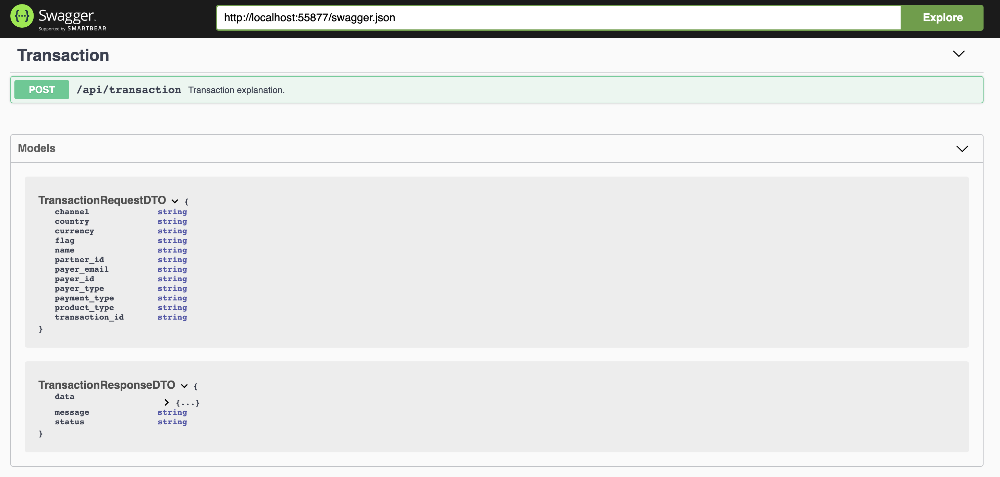

# Go Swagger

## Overview

Since documentation is a "must" for any API, we need to create a good documentation. But usually some engineers don't really enjoy that part, :). 
And also as a developers, we want to automate things. 

Swagger docs are nice, so it make us easier to create documentation. All we need to do is to write a json or yaml file describing our API in term of URLs, requests and responses with a specific syntax.

## Stack
So basically, this app was build using:

* Golang
* Swagger

## Prerequisite
* Install go v1.11 or above to use go modules
* Install [swagger](https://github.com/go-swagger/go-swagger/blob/master/docs/install.md)
* Make vendors copy of dependencies
    ```shell
        go mod vendor
    ```
    
## Usage
1. Run
    ```shell
        make check-swagger
            
            (Identify swagger version that has been installed on your laptop)

        make swagger 
            
            (Generate the new swagger format after doing some update on your data)

        make serve-swagger
            
            (Serve swagger documentation, can be use as API contract and share with QA Automation Engineer, so they can import and use for automation).
    ```

## Images
In this repo, there are two feature that implemented so far:
* After running `make serve-swagger`
    
    


## Reference
* Generate swagger specification from Go source code by [Pedram Hajesmaeeli](https://medium.com/@pedram.esmaeeli/generate-swagger-specification-from-go-source-code-648615f7b9d9)
